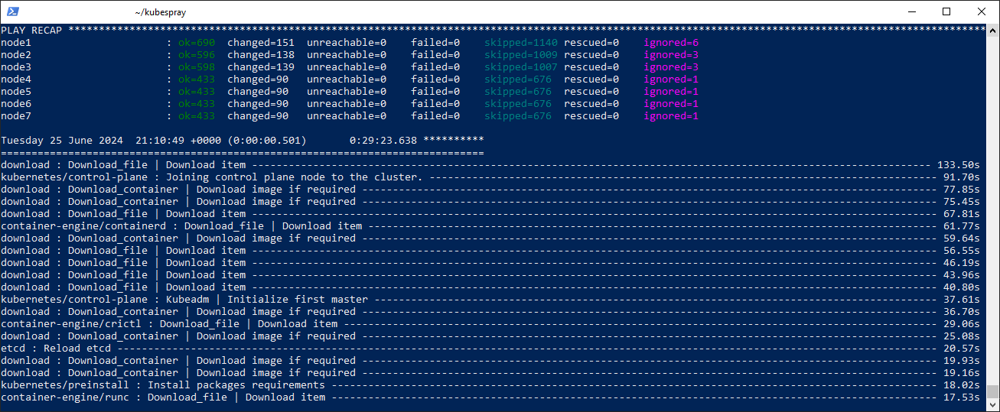
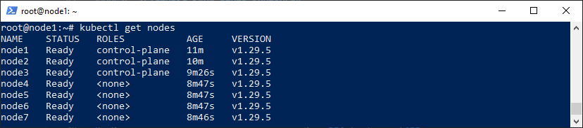

### Инструменты и дополнительные материалы, которые пригодятся для выполнения задания

1. [Инструкция по установке kubeadm](https://kubernetes.io/docs/setup/production-environment/tools/kubeadm/create-cluster-kubeadm/).
2. [Документация kubespray](https://kubespray.io/).
3. [Документация по установке ansible](https://kubespray.io/#/docs/ansible/ansible?id=installing-ansible)

-----

### Задание 1. Установить кластер k8s с 1 master node

1. Подготовка работы кластера из 5 нод: 1 мастер и 4 рабочие ноды.
2. В качестве CRI — containerd.
3. Запуск etcd производить на мастере.
4. Способ установки выбрать самостоятельно.

###  Решение 1
  
#### 1. Установка куба через kubespray

1. Устанавливаем среду python3 и пакетный менеджер pip совместимые с будущей версией ansible и kubespray:
   
   1. Рекомендуется установить список репозиториев ***ppa:deadsnakes/ppa***: 
       - ```sudo add-apt-repository ppa:deadsnakes/ppa```
       - Проверяем подключение всех репозиториев: ```apt update```
   2. Если python3 установлен, то проверяем его версию командой: ```python3 -v```, если нет , то инсталлируем командой: ```sudo apt install python3.10 -y```
   3. Проверяем наличие пакетного менеджера pip. Если он не установлен, то устанавливаем.
       - Проверяем версию: ```pip --version```
       - Если не установлен, то устанавливаем командой: ```apt install python-pip -y```
2. Копируем ключ на все ноды командой:
   ```ssh-copy-id root@<ip ноды>```
3. Скачиваем репозиторий kubespray:
   ```git clone --branch v2.25.0 https://github.com/kubernetes-sigs/kubespray.git```
4. Переходим в созданную папку kubespray:
   ```cd kubespray``` 
5. создаем список ip-адресов машин, разделяя адреса пробелами:
   ```declare -a IPS=(<ip мастер-нод> <ip рабочих нод>)```
6. подготавливаем папку с плайбуком будущего кластера. Копируем папку sample в mycluster:
   ```cp -rfp ~/kubespray/inventory/sample ~/kubespray/inventory/mycluster```
7. генерируем файл host.yaml в папке ***mycluster***. Используем генератор ```~/kubespray/contrib/inventory_builder/inventory.py```:
   ```CONFIG_FILE=~/kubespray/inventory/mycluster/hosts.yaml python3 ~/kubespray/contrib/inventory_builder/inventory.py ${IPS[@]}```
8. Включаем в файле ***addons.yaml***, расположенный в папке ***~/kubespray/inventory/mycluster/group_vars/k8s_cluster***
   - Helm: ```helm_enabled: true```
   - ingress контроллер: 
      ```
         ingress_nginx_enabled: true
         ingress_nginx_host_network: true
      ``` 
      
9. Разворачиваем кластер используя плейбук ***cluster.yml***:
     ```ansible-playbook -i inventory/mycluster/hosts.yaml -u $USERNAME -b -v --private-key=~/.ssh/id_rsa cluster.yml```
   - Для добавления ноды используем плейбук ***scale.yml***. Чтобы не трогать остальные ноды указываем ключ **--limit**:
     ```ansible-playbook -i inventory/mycluster/hosts.yaml -u $USERNAME -b -v --private-key=~/.ssh/id_rsa --limit=node5 scale.yml```
   - Для удаления используем(для версии 2.25 kubespray) плейбук ***remove-node.yml***. Чтобы не трогать остальные ноды используем ключ **-e node**:
     ```ansible-playbook -i inventory/mycluster/hosts.yaml -u $USERNAME -b -v --private-key=~/.ssh/id_rsa -e node=node5 remove-node.yml```

В итоге получаем:


10. Копируем admin.conf в ~/.kube/config:
   ```cp -rfp /etc/kubernetes/admin.conf ~/.kube/config```

В итоге видим набор узлов:
 

#### 2. Требования к ПО

  1. Минимальная версия kubernetes и ansible: 
     | kubespray      | kubernetes | Ansible Core  |  Источник                                                             |
     |----------------|------------|---------------|-----------------------------------------------------------------------|
     | 2.25           | 1.27       | 2.16.4        | [Proposal](https://github.com/kubernetes-sigs/kubespray/issues/11126) |
     | 2.24           | 1.26       | 2.15.5        | [Proposal](https://github.com/kubernetes-sigs/kubespray/issues/10720) |
     | 2.23           | 1.25       |  2.14         | [Proposal](https://github.com/kubernetes-sigs/kubespray/issues/10389) |
  
     Последняя версия(на момент 23.06.2024) ansible core - 2.17.1, устанавливается в пакете ansible версии 10.0.1
 
  2. Должно быть активировано ip4_fowarding
  3. Файрвол должен позволять осуществлять скачивание docker образов
  4. Установка осуществляется не из под root

#### 3. Требования к оборудованию

  1. Минимальная память  на мастер-ноде: 1.5 Гб
  2. Минимальная память на рабочей ноде: 1 Гб

#### 4. Устанавливаемые приложения при выполнении kubespray
         
   | kubespray      | Helm   | ArgoCD  | Calico  | Источник                                                             |
   |----------------|--------|---------|---------|-----------------------------------------------------------------------|
   | 2.25           | 3.14.2 | 2.11    | 3.27.3  | [Proposal](https://github.com/kubernetes-sigs/kubespray/issues/11126) |
   | 2.24           | 3.13.1 | 2.8.4   | 3.26.1  | [Proposal](https://github.com/kubernetes-sigs/kubespray/issues/10720) |
   | 2.23           | 3.12.3 | 2.0.0   | 3.25.2  | [Proposal](https://github.com/kubernetes-sigs/kubespray/issues/10389) |
  

## Дополнительные задания (со звёздочкой)

**Настоятельно рекомендуем выполнять все задания под звёздочкой.** Их выполнение поможет глубже разобраться в материале.   
Задания под звёздочкой необязательные к выполнению и не повлияют на получение зачёта по этому домашнему заданию. 

------
### Задание 2*. Установить HA кластер

1. Установить кластер в режиме HA.
2. Использовать нечётное количество Master-node.
3. Для cluster ip использовать keepalived или другой способ.
